# USOF - Frontend
## Description
Usof is a modern Q&A platform built with React, Redux, and a retro-futuristic design aesthetic. This is the frontend interface for the Usof Backend.
## Features
### Core Functionality
- **User Authentication** - Registration, login, email confirmation, password reset
- **Post Management** - Create, read, update, delete posts with rich content
- **Comment System** - Nested comments (up to 3 levels) with like/dislike functionality
- **Category Filtering** - Filter posts by multiple categories
- **Sorting Options** - Sort posts by likes or date
- **Search** - Real-time search across post titles and content
- **User Profiles** - Customizable profiles with avatar upload
- **Notifications** - Real-time notification system for post interactions
- **Admin Panel** - Comprehensive admin controls for users, posts, comments, and categories
### UI/UX Features
- Retro-futuristic design with VT323 font
- Fully responsive layout (mobile, tablet, desktop)
- Image modal for full-screen viewing
- Pagination with "Load More" functionality
- Real-time data updates
## Technologies Used
- **React 19.2.0** - UI library
- **Redux Toolkit 2.9.0** - State management
- **React Router DOM 7.9.4** - Routing
- **Axios 1.12.2** - HTTP client
- **Vite 7.1.7** - Build tool
- **ESLint** - Code linting
## Requirements
- **Node.js** (v18 or higher)
- **npm**
- **Backend API** running (from `usof-backend` project in API folder)

## Installation
1. Clone the repository
```bash
git clone https://github.com/Teyvani/Usof-Frontend.git
cd usof-frontend
```
2. Install dependencies
```bash
npm install
```
## Running the Application
1. Start backend by:
```bash
cd API
npm install
npm start
```
Server will start at `http://localhost:3000`
2. Start the React App (Development Mode):
```bash
npm run dev
```
## Available Routes
| Route | Description | Acces |
|-------|-------------|-------|
| `/` | Home page | Public |
| `/login` | Login page | Public |
| `/register` | Registration page | Public |
| `/confirm-email` | Email confirmation | Public |
| `/request-reset-password` | Password reset request | Public |
| `/reset-password` | Password reset | Public |
| `/posts` | All posts list | Public |
| `/posts/:id` | Post detail page | Public |
| `/posts/create` | Create new post | Authenticated |
| `/posts/:id/edit` | Edit post | Author |
| `/profile/:id` | User profile | Public |
| `/admin` | Admin panel | Admin only |

## Screenshots of program working
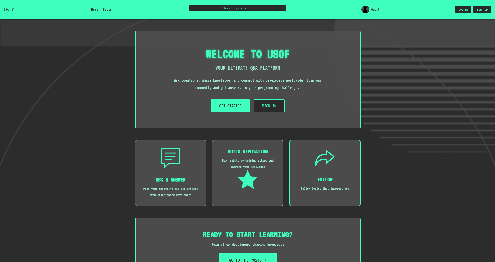
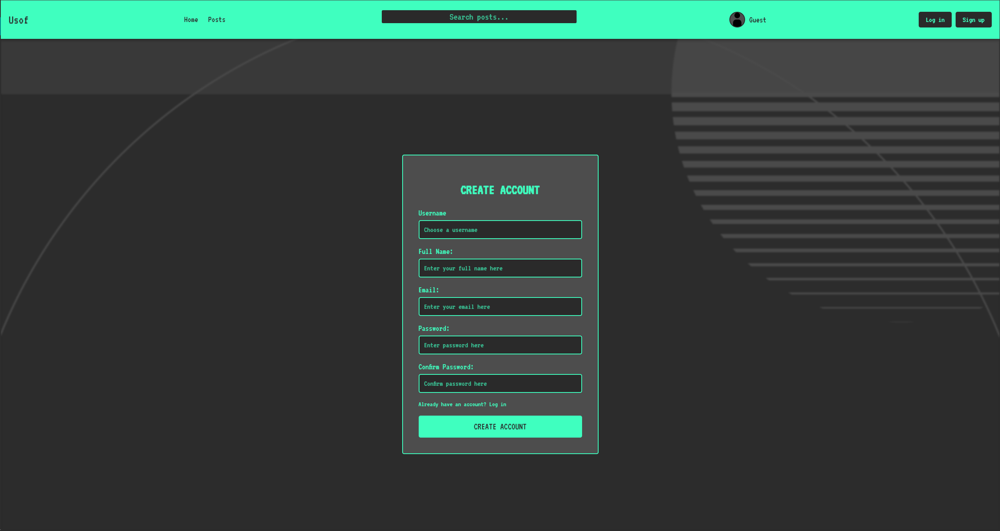

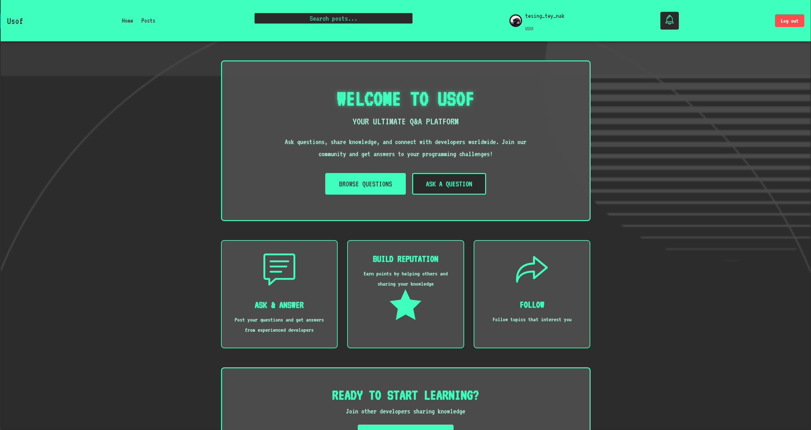
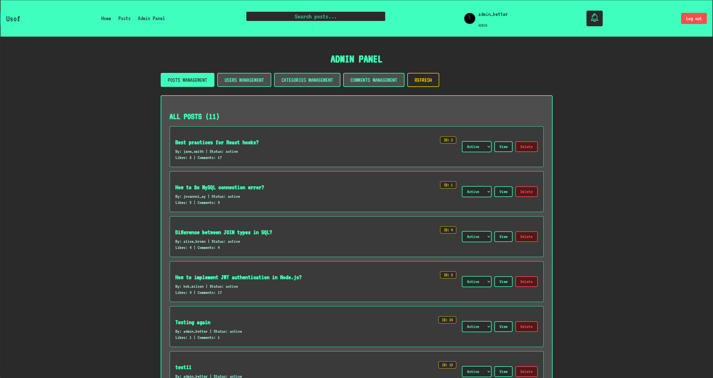
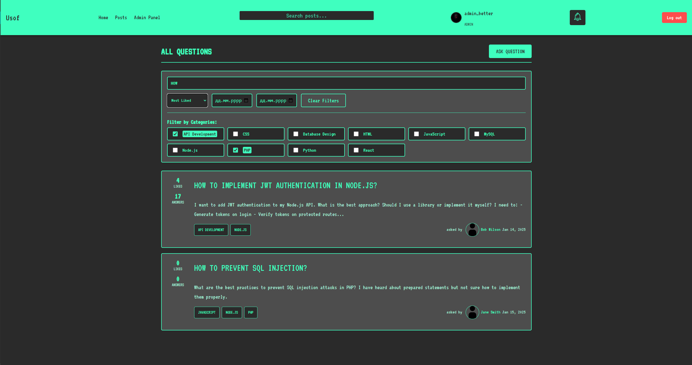
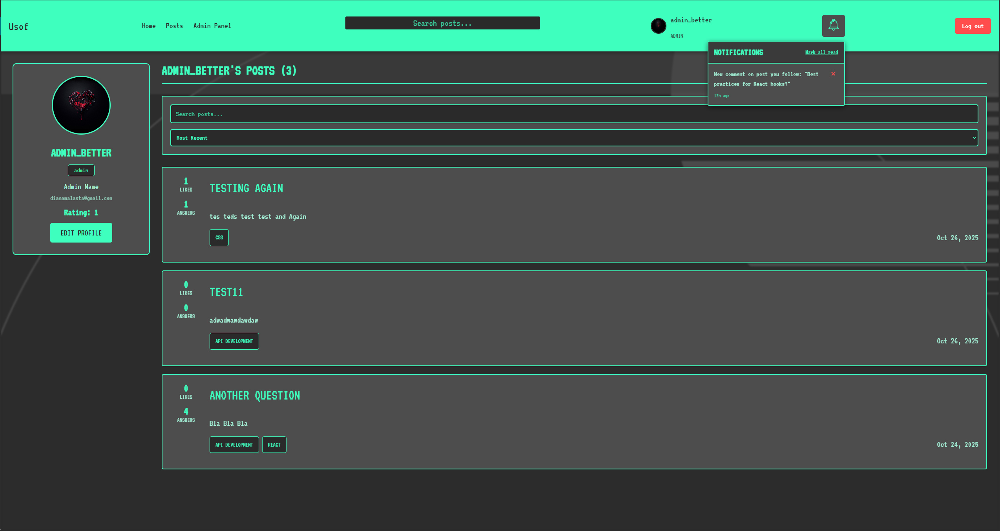
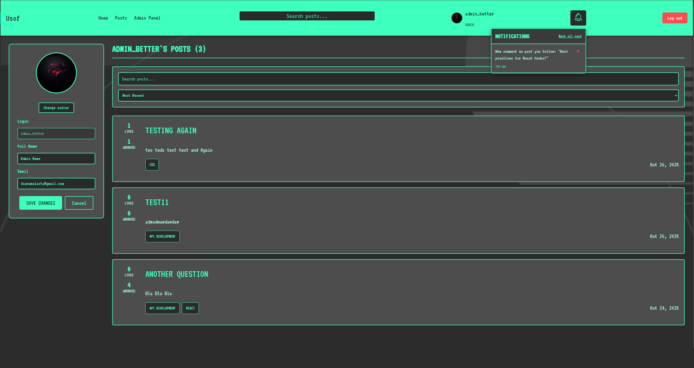
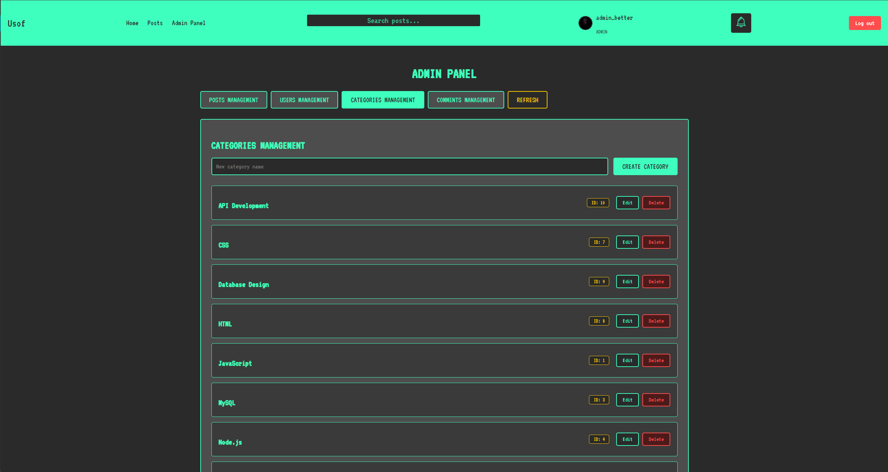
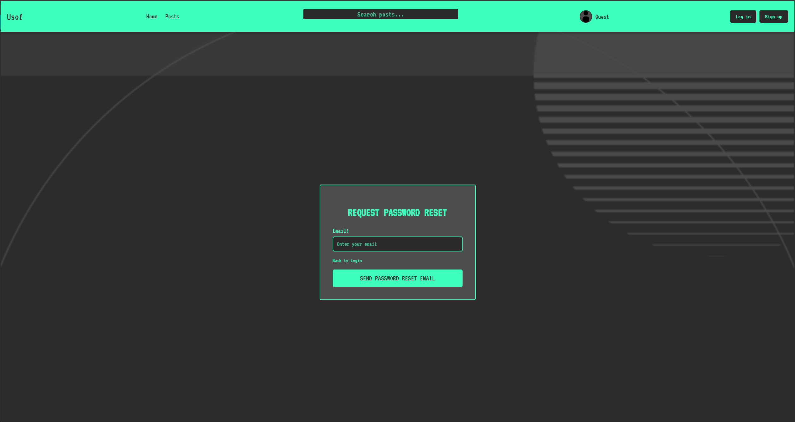
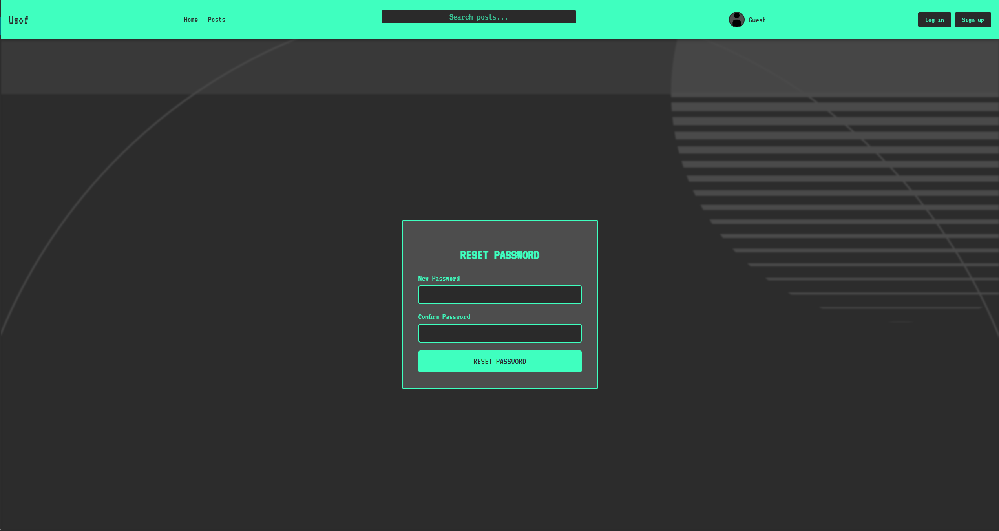
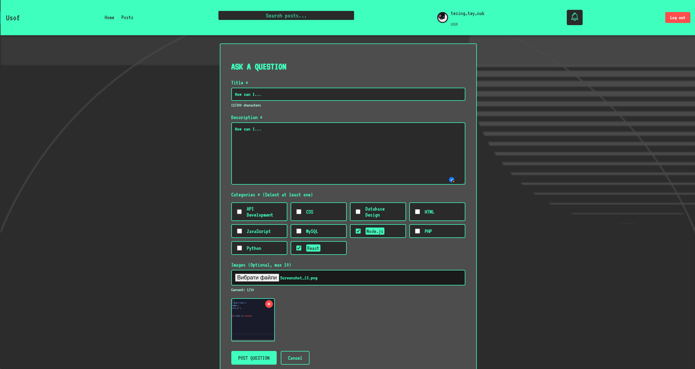
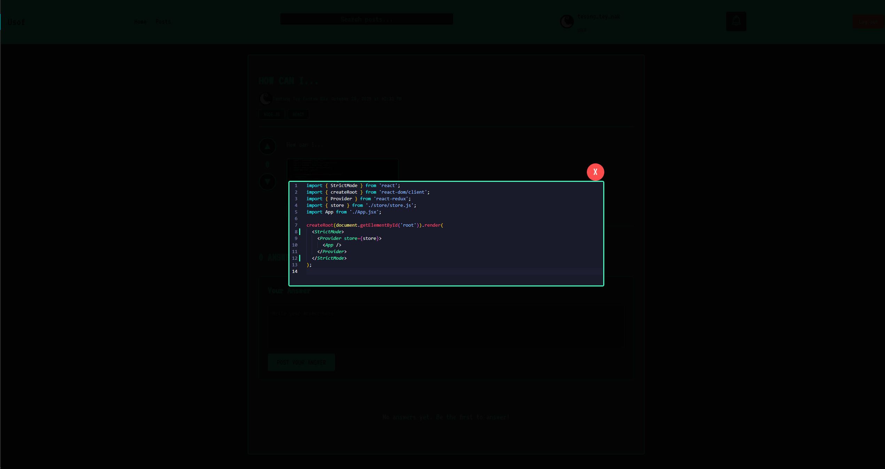
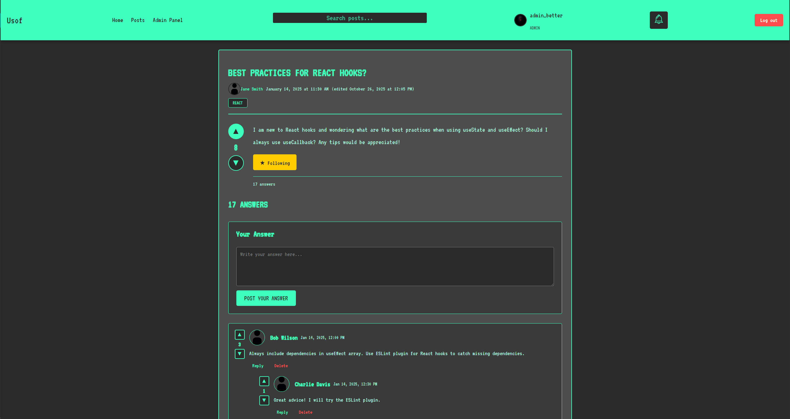
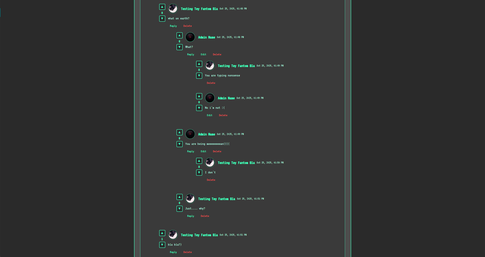
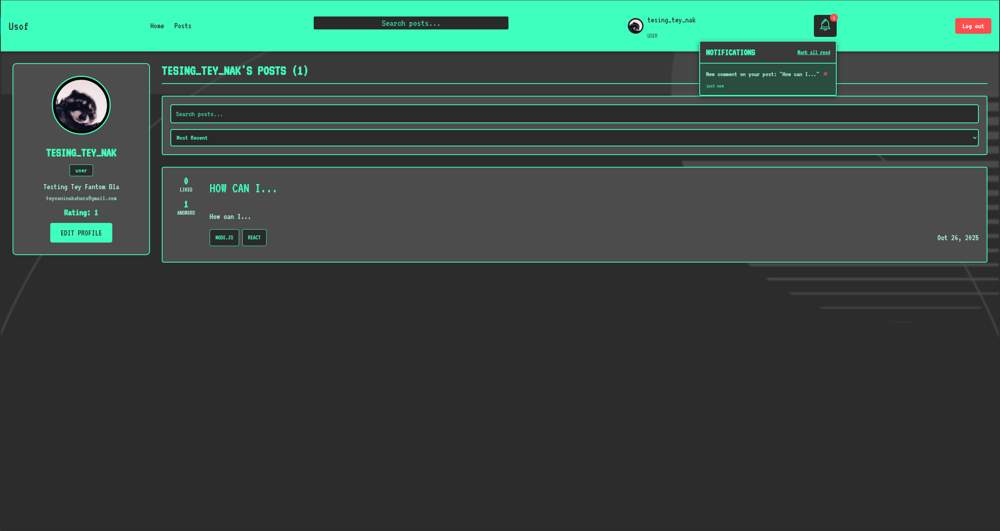
